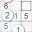

# 
推敲数独

    <a href="README.md" style="text-decoration: none; color: #007bff;">English</a>

**推敲数独** 提供了一种独特的解谜方法，使用 **数独逻辑**，不是输入数字，而是通过输入逻辑来确定数字在网格中的位置。

### 数独术语
标准的数独谜题由一个 9x9 的方格组成，分为 3x3 个**宫**。9 个**宫**、9 个**行** 和 9 个**列**，共 27 个**单元** 81 个**格**。解谜是用 **1** 到 **9** 的 **数字** 填满所有的**格**，确保每个**数字** 在每个**单元** 中恰好出现一次。

### 数独逻辑如何工作
数独逻辑只有两个组成部分：**推** 和 **敲**，这两者都是基于目标单元。
- **敲** 是指从目标单元中敲掉（消除）可能的数字，直到只剩下一个空格。
- **推** 是指在目标单元的可能格中填入填充数字，直到只剩下一个空格。

以下是如何将**推**和**敲**应用于各种数独技巧：

1. **唯一数**：单元中只剩下唯一一个空格。 
   谜题中点击单元的唯一空格以选择宫，水平或垂直滑动以选择行或列作为目标单元。目标单元在数字格中以浅绿色高亮显示，唯一的空格以绿色显示。然后点击网格中与缺失数字对应的任何数字格，将其选择为**敲击数**，该格以橙色高亮显示，**敲击数**被填入目标单元中唯一的空格。
   [More Details](https://touchsudoku.github.io/blog/cn/sudoku-rules-and-terminologies.html)
   &nbsp;

2. **摒除**：单元外数字摒除单元内的相同数字。 
   谜题中点击宫中的一个空格，或水平或垂直滑动以选择行或列作为目标单元。目标单元在数字格中以浅绿色高亮显示，留下多个空格以绿色显示。然后点击网格中的一个数字格，将其选择为**敲击数**，以橙色高亮显示。该数字向目标单元发出浅黄色光束，**敲**掉绿色格中的数字，通过将它们着色为黄绿色来标记。点击另一个相同数字的格以添加更多**敲击数**，直到目标单元中只剩下唯一绿色格。敲击数被填入目标单元中唯一的空格。
   [Live Demo](https://touchsudoku.github.io/blog/cn/sudoku-technique-no1-pointing-out-easy-level.html)
   &nbsp;

3. **数对**：单元中多个空格摒除非相邻的目标单元的相同空格。 
   - **宫数对**：如果一个宫中的多个格都可能敲向一个非相邻的目标单元的相同空格，该单元可以确定**敲击数**，以**敲**掉该目标单元中的相同数字。
   - **行列数对**：如果一行或一列中的多个空格位于同一宫中，该单元可以确定**敲击数**，以**敲**掉列或行中位于同宫中的相同数字。

   要使用 **数对** 技巧，首先选择目标单元，然后点击非相邻单元中的多个空格之一以选择它，可能需要添加**敲击数**来**敲**掉该单元中的多余空格，使之成为**敲击单元**。 
   **敲击单元**通常有 2 个**敲击格**，所以叫**数对**，但也可能有 3 个**敲击格**。 
   **敲击单元**可以传递，这意味着它们可以敲向另一个单元，依此类推，直到它们到达目标单元。
   [Live Demo](https://touchsudoku.github.io/blog/cn/sudoku-technique-no2-pointing-out-medium-level.html)
   &nbsp;

4. **唯一余数**：空格中只可能填入唯一一个数字。 
   点击宫中的一个空格，或水平或垂直滑动以选择行或列作为目标单元。目标单元在数字格中以浅绿色高亮显示，留下多个空格以绿色显示。然后长按谜题中的一个数字格，将其选择为**填充数**，该填充数以蓝色高亮显示。**填充数**被**推**入目标单元，占据一个绿色格， 着色为紫蓝色来标记。点击另一个不同数字格以添加更多**填充数**，直到目标单元中只剩下一个绿色格。最后，点击谜题中缺失数字的格，将其填入目标单元中唯一的空格。
   [Live Demo](https://touchsudoku.github.io/blog/cn/sudoku-technique-no3-fitting-in-medium-level.html)
   &nbsp;

更多技巧请查看 [Touch Sudoku Blog](https://touchsudoku.github.io/blog/cn/)

<!-- [推敲数独下载](https://play.google.com/store/apps/details?id=com.touchsudoku.app) -->

<!-- [博客](http://touchsudoku.blogspot.com/) -->
