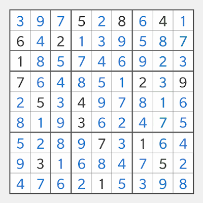
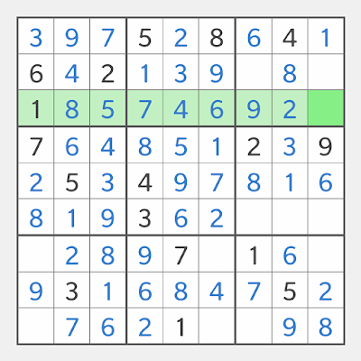

# 
 Touch Sudoku

    <a href="README-zh.md" style="text-decoration: none; color: #007bff;">中文</a>

**Touch Sudoku** presents a unique approach to solving puzzles using **Sudoku Logic**, not by inputting numbers, but by applying logic to deduce the placement of numbers in the grid.

### Sudoku Terminology
A standard Sudoku puzzle consists of a 9x9 grid divided into 3x3 boxes. The grid has 9 **boxes**, 9 **rows**, and 9 **columns**, totaling 27 **units** and 81 **cells**. The objective is to fill all the **cells** with **numbers** from **1** to **9**, ensuring that each **number** appears exactly once in each **unit**.

### How Sudoku Logic Works
There are only 2 components in Sudoku Logic: **Pointing Out** and **Filling In**, both are based on target units.
- **Pointing Out** is to point out (eliminate) possible cells of the pointer number from target units, until one empty cell left.
- **Filling In** is to fill in the filler numbers in possible cells of target units, until one empty cell left.

Here are how to apply them to a puzzle:

1. **Single Candidates**: This technique is used when only one empty cell is left in a unit. 
   Tap the only empty cell to select the unit, or swipe horizontally or vertically to select a row or column as a target unit. The target unit is highlighted in light green for number cells, leaving the only empty cell in green. Then tap any number cell in the grid that corresponds to the missing number to select it as a **pointer**, which is highlighted in orange. The pointer number is then filled into the only empty cell in the target unit.
   
   
   
   [More Details](https://touchsudoku.github.io/blog/en/sudoku-rules-and-terminologies.html)
   &nbsp;

2. **Hidden Singles**: This technique is applied when a number can only fit in one cell of a unit. 
   Tap one of the empty cells in the box, or swipe horizontally or vertically to select a row or column as a target unit. The target unit is highlighted in light green for number cells, leaving multiple empty cells in green. Then tap a number cell in the grid to select it as a pointer, which is highlighted in orange. The pointer sends out light-yellow beams to target units **Pointing Out** the number from the green cells by coloring them yellow-green. Tap another cell with the same number to add more pointers if needed, until only one green cell is left in the target unit. The pointer number is then filled into the only empty cell in the target unit.
    
   [Live Demo](https://touchsudoku.github.io/blog/en/sudoku-technique-no1-pointing-out-easy-level.html)
   &nbsp;

3. **Pointing Pairs**: This technique allows units to act as pointers. 
   - **Box Pointer to Other Units**: If multiple cells in a box all point to one direction of a non-adjacent target unit, it can be selected as a pointer to eliminate the pointer number from empty cells in that target unit.
   - **Line Pointer to Other Lines**: If multiple cells in a row or column are within one box, it can be selected as a pointer to eliminate the pointer number from empty cells in the column or row in that box.

   To solve using **Pointing Pairs**, select the target unit first, then tap one of the empty cells in the non-adjacent unit to select it. It can be a pointer unit already; add a pointer for the unit to make it a pointer if needed. 
   Note that unit pointers usually have 2 pointer cells but can possibly have 3 pointer cells. 
   Unit pointers relay, meaning they can make another unit a pointer, and so on until they reach the target unit.
    
   [Live Demo](https://touchsudoku.github.io/blog/en/sudoku-technique-no2-pointing-out-medium-level.html)
   &nbsp;

4. **Naked Singles**: This technique is used when a cell can only contain one number. 
   Tap one of the empty cells in the box, or swipe horizontally or vertically to select a row or column as a target unit. The target unit is highlighted in light green for number cells, leaving multiple empty cells in green. Then tap and hold a number cell in the grid to select it as a **filler**, which is highlighted in blue. The filler number is **Filling In** the target unit and takes the place of one of the green cells by coloring it shaded purple-blue. Tap another cell with a different number to add more fillers if needed, until all but one green cell is filled in the target unit. Finally, tap the cell with the missing number to fill it into the only empty cell in the target unit.
    
   [Live Demo](https://touchsudoku.github.io/blog/en/sudoku-technique-no3-fitting-in-medium-level.html)
   &nbsp;

More techniques see [Touch Sudoku Blog](https://touchsudoku.github.io/blog/en/)
More techniques see [Touch Sudoku Blog](https://touchsudoku.github.io/blog/en/)

<!-- [Touch Sudoku Download](https://play.google.com/store/apps/details?id=com.touchsudoku.app) -->

<!-- [BlogSpot](http://touchsudoku.blogspot.com/) -->
